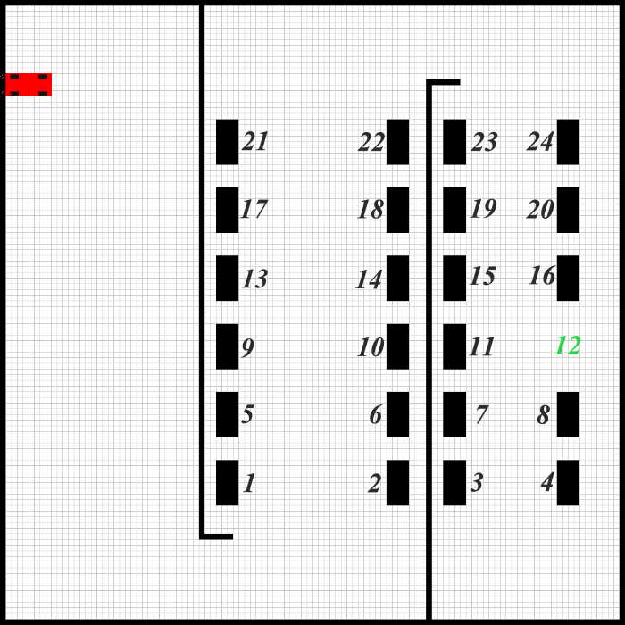
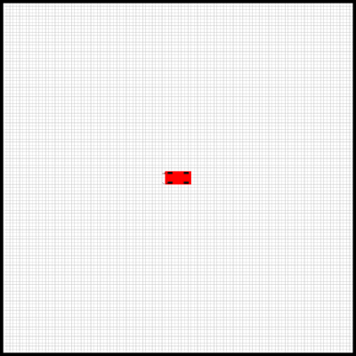
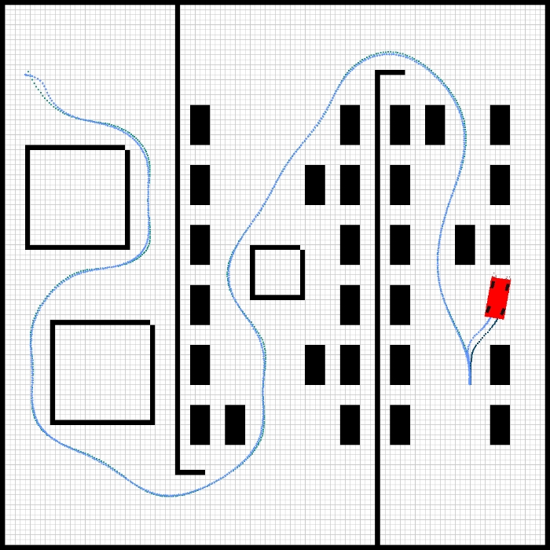

# Auto Park System : Path Planning, Path Tracking & Control
This repository contains an auto park system including path planning, path tracking, and parallel parking in a designed environment.


run the code using this command:
```
$ python main_autopark.py --x_start 0 --y_start 90 --parking 7
```
you can choose the parking spot from 1 to 24:



## Envroinment
Our first step to develop an auto park system was to design and develop an environment capable of giving visual render using ```OpenCV``` library.
Environment is implemented in ```environment.py``` as a class and recieves obstacles at the beginning ```env = Environment(obs)```.
Agent can be placed using ```env.render(x,y,angle)```.
A sample of environment is displayed bellow.


## Path planning

#### A* algorithm
The agent will find a path from start to its goal using A*.
This implementation of A* from [PythonRobotics](https://pythonrobotics.readthedocs.io/en/latest/modules/path_planning.html), considers parameters like obstacles and robot radius.

#### interpolating path with b-spline
After finding a path in a descrete 100\*100 space, the path is smoothed and scaled to 1000\*1000 space of environment using b-spline.
The result is a set of points to guide our agent!

## Path tracking
**Kinematic model** of the car, is:
```math
x = vcos(ϕ)
y = vsin((ϕ)
v = a
ϕ = vtan(δ)L
```
**State vector** is:
```math
z=[x,y,v,ϕ]
```
x: x-position, y:y-position, v:velocity, φ: yaw angle

**Input vector** is:
```math
u=[a,δ]
```
a: accellation, δ: steering angle

The MPC controller controls vehicle speed and steering based on the model and car is directed through the path.

## Parallel parking
This part consists of 4 rules that agent must choose one according to parking position.
At first the agent will find a path to park position then it will compute the arriving angle.
Based on the arriving angle, agent chooses a coordinate as ensure1.
After that, parking path is planned from ensure1 to ensure2 using 2 circle equations as mentioned below.
MPC controls the agent and car parks in ensure2 coordinate.


